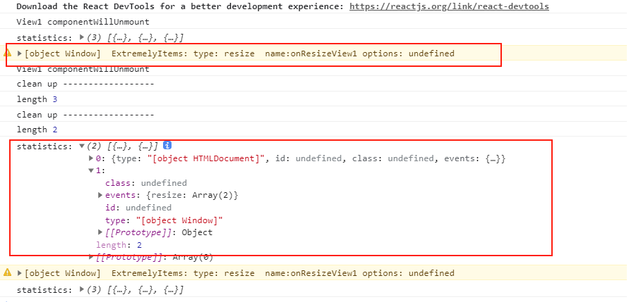
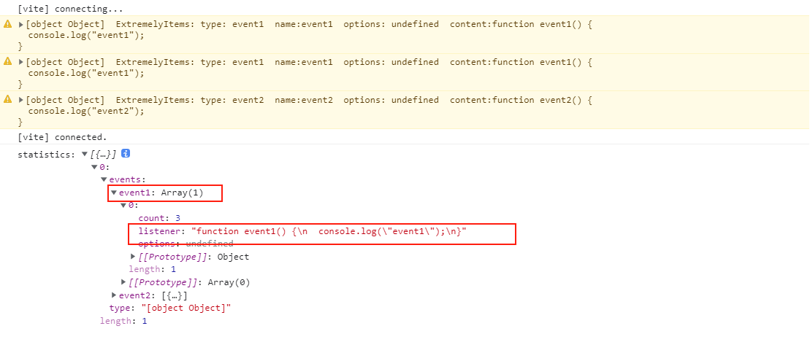

## 目标和初衷
按需监听事件处理程序，并对重复添加进行预警，并统计你关心事件处理程序。

完成思路，请参考：
* [理论篇 - 上]()
* [代码篇 - 下]()


EventTarget系列demo截图：



events系列demo截图：




## 支持
1. [EventTarget](https://developer.mozilla.org/zh-CN/docs/Web/API/EventTarget)
2. DOM节点 + windwow + document
    其继承于 EventTarget
3. XMLHttpRequest
    其继承于 EventTarget
4. 原生的WebSocket
   其继承于 EventTarget
5. nodejs 标准的 [events](https://github.com/browserify/events)
6. MQTT
   基于 [events](https://github.com/browserify/events)库
7. `socket.io` 
   基于 [events](https://github.com/browserify/events)库
8. `socket.io-client`
   基于[component-emitter](https://www.npmjs.com/package/component-emitter)库

## 如何使用

### 监听DOM事件
```html
   <script src="http://127.0.0.1:8080/dist/evm.js?t=5"></script>
    <script>
        const evm = new EVM.ETargetEVM({
            isInWhiteList(target, event, listener, options) {
                if (target === window && event !== "error") {
                    return true;
                }
                return false;
                // return true;
            }
        });
        evm.watch();

        // 周期性监听
        setInterval(async function () {
            console.log("-------");
            // statistics getExtremelyItems
            const data = await evm.getExtremelyItems();
            console.log("evm:", data);
        }, 3000)
        // window.__evm__ = evm;
        // window.__evm__.getExtremelyItems().then(data=>  console.log("evm::", data));
        // window.__evm__.statistics().then(data=>  console.log("evm::", data));
    </script>
```


### EventEmitter

```js
import { EventEmitter } from "events";

; (function evmCheck() {

    const win = window as any;
    const evm = win.__evm__ = new win.EVM.EventsEVM(undefined, EventEmitter);
    evm.watch();
    setTimeout(async function () {
        // console.log("-------");
        // statistics getExtremelyItems
        const data = await evm.getExtremelyItems();
        console.log("evm:", data);
    }, 5000)


    // window.__evm__.getExtremelyItems().then(data=>  console.log("evm::", data));
    // window.__evm__.statistics().then(data=>  console.log("evm::", data));

})();
```


## 涉及的知识点

1. DOM事件来源
2. DOM的基本操作
3. 事件中心
4. 方法拦截
   可参见[7中方法拦截手段](https://github.com/xiangwenhu/topics/tree/master/%E6%8B%A6%E6%88%AA%E6%96%B9%E6%B3%95)
5. ES6 Map
6. ES6 class 私有变量
7. ES6 模块JS & mjs
8. ES6 Proxy
9. ES  WeakRef
10. ES FinalizationRegistry


**其他**   
1. 属性键的最大长度？
2. 查找数组中相同的项目


## 规划
1. 插件？


## DOM节点如何统计事件信息

* **getEventListeners**
https://github.com/colxi/getEventListeners 
其只是直接修改了原型方法，结果可行，不推荐这么玩。

缺点
1. 入侵了每个节点，节点上保留了事件信息
2. 单次只能获取一个元素的监听事

* **chrome 控制台 getEventListeners获得单个Node的事件**
缺点
1. 只能在控制台使用
2. 单次只能获取一个元素的监听事件

* **chrome控制台， Elements => Event Listeners**
1. 只能在开发者工具界面使用
2. 查找相对麻烦

* **chrome more tools => Performance monitor 可以得到 JS event listeners, 也就是事件总数**

并未有详细的信息，只有一个统计数据
  